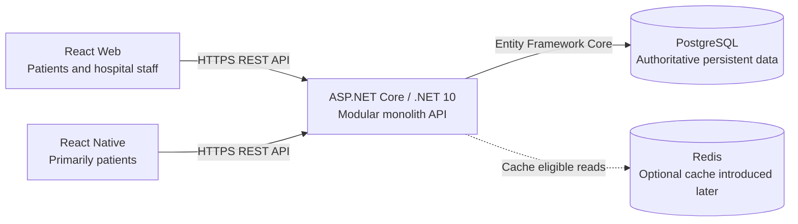
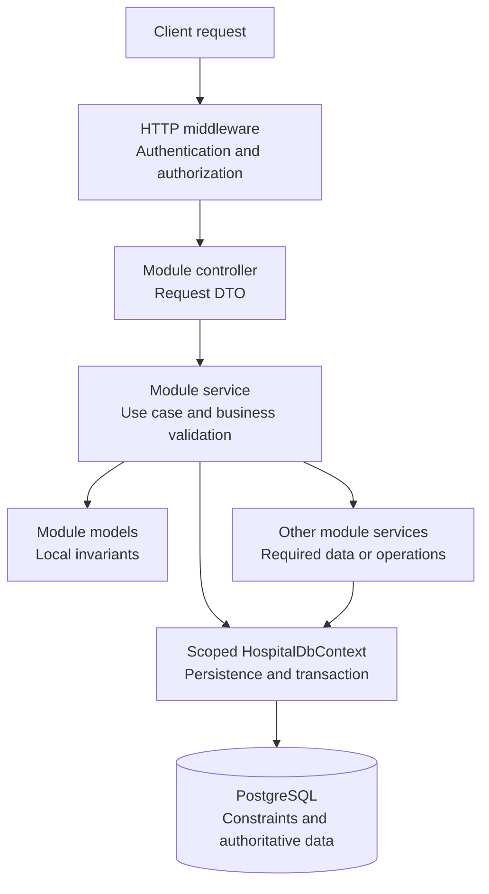

# Hospital Platform — Application Architecture

## 1. Purpose

This document defines the initial application architecture for Version 1, based on the [Domain Model](DomainModel.md) and [ERD](ERD.md).

The backend is a modular monolith: one ASP.NET Core application, organized by functional module, deployed as one unit.

The initial proposal uses one backend project and one PostgreSQL database. Module boundaries are enforced through code organization, service contracts, review, and tests; folders alone do not enforce isolation.

This document describes the application. Detailed AWS topology, load balancing, and container orchestration will be documented during the infrastructure stage.

---

## 2. Application Overview



Both clients use the same backend rules. Clients do not connect directly to PostgreSQL or Redis.

PostgreSQL stores accounts, profiles, verification records, specialties, availability, and appointments. Redis may later cache relatively stable specialty or public doctor information when there is a measurable benefit.

Redis is not the authority for appointment availability, patient verification, or authorization decisions.

---

## 3. Backend Organization

The proposed structure is:

```text
HospitalPlatform.Api/
├── Modules/
│   ├── Authentication/
│   │   ├── Controllers/
│   │   ├── Services/
│   │   ├── DTOs/
│   │   └── Models/
│   ├── Users/
│   ├── Patients/
│   ├── Doctors/
│   ├── Staff/
│   ├── MedicalSpecialties/
│   ├── Availability/
│   └── Appointments/
├── Infrastructure/
│   ├── Persistence/
│   │   ├── HospitalDbContext.cs
│   │   ├── Configurations/
│   │   └── Migrations/
│   └── Caching/
├── Middleware/
├── Authorization/
└── Program.cs
```

Each module follows the same Controllers, Services, DTOs, and Models organization where needed. Empty folders or classes are not required merely to match the tree.

Authentication.Models is reserved for authentication persistence such as refresh-token records; its detailed design is pending. It does not duplicate User.

Caching is introduced when an actual cache use case is implemented.

### Folder Responsibilities

| Folder | Responsibility |
| --- | --- |
| Controllers | HTTP endpoints, binding, response mapping, and endpoint authorization declarations |
| Services | Application use cases, coordination, business validation, and transaction boundaries |
| DTOs | Request and response contracts; entities are not returned directly |
| Models | Domain entities and states owned by the module, including their local invariants |
| Infrastructure/Persistence | EF Core context, mappings, migrations, and database-specific constraints |
| Infrastructure/Caching | Redis integration for selected read use cases |
| Middleware | Shared HTTP concerns such as error handling and request logging |
| Authorization | Policies for roles, account access, and resource ownership |
| Program.cs | Application composition and dependency registration |

Controllers call services rather than querying the database directly. Models do not depend on controllers, DTOs, HTTP, or Redis.

Services may use EF Core directly for their module's data. Version 1 does not require a generic repository layer or an additional unit-of-work abstraction over DbContext.

---

## 4. Module Responsibilities

| Module | Owned information and behavior |
| --- | --- |
| Authentication | Login, access-token issuance, refresh-token rotation and revocation, logout |
| Users | User accounts, shared names and email, password hashes, AccountStatus, account updates, technical EmployeeNumbers registration |
| Patients | Patient profiles, public registration workflow, in-person registration and identity verification |
| Doctors | Doctor profiles, employee and license information, doctor-specialty assignments |
| Staff | Staff profiles, EmployeeNumber, StaffRole, administrator-managed staff creation |
| MedicalSpecialties | Specialty catalog, Name, IsActive, specialty administration |
| Availability | DoctorAvailability periods and protection of existing appointments when availability changes |
| Appointments | Booking, cancellation, completion, rescheduling, schedules, history, calculated bookable slots |

Appointments owns persisted CancellationReason and the receptionist review/cancellation use case under [ADR-0011](adr/0011-service-interruption-cancellations.md). Doctor account and specialty state changes block new scheduling but do not automatically cancel appointments. Booking validates current doctor and specialty eligibility against authoritative data.

Both patient clients display cancellation information and next-step instructions from appointment lists and details, including future cancelled appointments, when loaded or refreshed. This does not introduce a separate notification module, background delivery, or real-time messaging in Version 1.

DoctorSpecialty belongs to Doctors as a persistence association with MedicalSpecialties. Appointment retains separate DoctorId and MedicalSpecialtyId references.

Doctors rejects assignment removal while the doctor has future Scheduled appointments for that specialty. The coordinating use case obtains the blocking-appointment check through Appointments within the ADR-0005 transaction and locks. Reception cancels affected appointments first with a patient-visible reason and the existing in-app guidance; assignment removal does not cancel appointments or delete their history.

Patient verification is a Patients use case, restricted to authorized receptionists. Administration is an actor capability expressed through authorized endpoints in the relevant modules, rather than a second owner of their data.

Bookable-slot calculation belongs to Appointments because it combines availability periods with occupied appointment intervals. Availability supplies the periods; Appointments supplies the occupied intervals and performs scheduling operations.

Scheduling uses the [ADR-0009](adr/0009-appointment-time-policy.md) policy: 30-minute appointments on a half-hour grid Monday through Friday within 09:00–18:00 in America/Montevideo. API timestamp instants use UTC or explicit offsets; local-hour and weekday validation must not depend on deployment or client time-zone defaults. Non-working dates are handled through absent doctor availability, with no separate holiday calendar or automatic holiday exclusion. Existing appointments affected by a later absence use receptionist cancellation and the in-app guidance before their availability is changed.

---

## 5. Request Flow



The service maps the result into response DTOs for the controller. Expected business failures are returned through consistent API responses; unexpected errors are handled centrally without exposing internal details.

Endpoint policies protect the operation. Resource ownership and business eligibility are checked using the relevant data during execution, not only through client UI restrictions or token claims.

---

## 6. Module Communication

Modules communicate through in-process service calls. There are no internal HTTP calls or message brokers in the initial design.

Each module owns mutations of its data. Other modules request an operation from that owner instead of editing its entities directly.

Cross-module service contracts should expose only the data or operation required by the caller. They should not expose DbContext, DbSet, IQueryable, or mutable tracked entities.

A service interface is added when it defines a boundary used by another module or separates an external dependency. Every concrete service does not automatically need an IService counterpart.

For example:

- Patients coordinates registration with Users to create an account and a Patient profile together.
- Doctors and Staff coordinate their administrator-created accounts with Users.
- Users registers each employee number centrally in EmployeeNumbers for the owning account; Doctors and Staff reference that registration for their profiles.
- Doctors validates specialty assignments through MedicalSpecialties.
- Appointments obtains patient eligibility, doctor-specialty assignment, and availability through their owning modules.

Mutually dependent workflows, such as booking versus availability changes, must not produce service-call cycles. The coordinating use case owns the transaction; supporting services follow the shared lock order in [ADR-0005](adr/0005-scheduling-concurrency.md). Concrete service contracts remain implementation work.

Shared technical infrastructure must not become a container for business logic that has a clear module owner.

---

## 7. Persistence and Transactions

The initial proposal uses one scoped HospitalDbContext shared by the services participating in a request. This permits atomic workflows across modules within the same database.

The service coordinating a write use case owns the transaction and commit. Supporting service operations must participate in that transaction rather than independently committing partial results.

Examples requiring atomic persistence include:

- User and profile creation;
- employee account, EmployeeNumbers registration, and Doctor or Staff profile creation;
- patient identity verification and activation of an eligible PendingVerification account;
- appointment booking;
- appointment rescheduling.

Rescheduling updates the existing Appointment's StartTime, EndTime, and UpdatedAt in one transaction, preserving its identifier, associations, creation timestamp, and Scheduled status. Failure rolls back the operation. [ADR-0010](adr/0010-rescheduled-existing-appointment.md) defines this time-only workflow; concurrent mutations of the same appointment must participate in the selected concurrency protocol.

Cross-module reads involved in a write must use authoritative data and the transaction/locking strategy chosen for that workflow. Reading valid data before a transaction is not sufficient if another request can change it before the write completes.

Scheduling uses READ COMMITTED transactions and the ADR-0005 lock order: affected User rows, MedicalSpecialty rows, Doctor rows, then existing Appointment rows, sorting Ids within each table. Eligibility reads use shared parent-row locks; eligibility mutations use exclusive locks. Every appointment, availability, or assignment mutation exclusively locks its Doctor row. Services reload current data after locking before validating and writing.

PostgreSQL exclusion constraints protect overlapping appointment and availability intervals. These do not replace patient eligibility, doctor-specialty membership, or availability containment checks. Appointment mutation requests supply the expected UpdatedAt; stale values are rejected and successful mutations persist a strictly newer value at database precision.

Global EmployeeNumber ownership is enforced through the EmployeeNumbers registry primary key and composite foreign keys from Doctor and Staff. Registry creation participates in the employee-registration transaction; it is not a separate domain module.

Users owns the dedicated NormalizeEmail policy used for account creation, permitted email changes, and Authentication's email-based login lookup. It trims exterior whitespace and converts to lowercase independently of server culture; input validation rejects internal whitespace and preserves dots and plus suffixes. Persist only validated canonical values in User.Email and enforce UNIQUE (Email) in PostgreSQL. Do not apply this policy as a generic text normalizer to other fields.

Users allocates employee numbers from one PostgreSQL bigint sequence shared by Doctor and Staff under [ADR-0007](adr/0007-employee-number-registry.md), formatting canonical EMP- text with at least six digits. Numbers are immutable and not reused; allocation may leave gaps on rollback while account/profile/registry rows remain atomic. Response DTOs expose numbers only to authorized hospital personnel, excluding public doctor data and patient responses.

Exactly-one-profile enforcement uses User.ProfileType, fixed profile-table discriminators, composite foreign keys, unique UserId, and initially deferred constraint triggers, as selected in [ADR-0008](adr/0008-single-user-profile.md). Registration services must handle validation failures at transaction commit; migrations and tests must verify the database behavior.

The selected scheduling protocol and the locking/visibility details of profile mutations require implementation and PostgreSQL concurrency tests. Authentication operations must respect the User-before-session ordering when participating in account changes. The employee-number registry and shared DbContext do not replace these guarantees.

---

## 8. Authentication and Authorization

User is the authentication account; Patient, Doctor, and Staff are associated profiles.

User.ProfileType identifies the single associated profile type. It does not replace StaffRole or resource-ownership and account-status checks.

Authorization distinguishes Patient, Doctor, Receptionist, and Administrator. The two staff roles are derived from StaffRole, not separate profile tables.

Protected operations must account for current account status. PendingVerification patients may log in, refresh, log out, and read only their own account/profile, account and identity-verification status, and verification instructions. Deny other protected patient operations, including profile updates and appointment management. Public specialty and doctor information remains accessible. Booking and rescheduling require verified identity and an Active account. Suspended and Deactivated accounts cannot perform protected operations.

JWT access tokens have a maximum 15-minute lifetime and identify User.Id through sub and a persistent authentication session through sid. Each login creates an independent session with an absolute 7-day expiry; refresh does not extend that deadline.

Every protected request validates the JWT and reads session ownership/state and current account/profile permissions from PostgreSQL. Role claims do not replace current AccountStatus, ProfileType, StaffRole, ownership, or patient eligibility checks.

Refresh tokens are opaque random credentials, stored only as SHA-256 hashes and rotated atomically while locking the session row. Reuse of a consumed token revokes its session. Logout revokes the current session; suspension/deactivation atomically revokes the User's sessions, with new login required after reactivation.

These records belong to Authentication and are defined in [AuthenticationModel.md](AuthenticationModel.md) and [ADR-0012](adr/0012-authentication-sessions.md). Web refresh-cookie storage remains proposed pending deployment/CSRF details; signing-key design remains to be finalized.

---

## 9. Testing and Operations

Unit tests cover local rules and state transitions. Integration tests cover API behavior, PostgreSQL persistence, authorization, and transactions. Concurrency tests exercise simultaneous booking, rescheduling, and conflicting mutations.

Database-specific concurrency tests must use PostgreSQL rather than relying on an in-memory substitute.

The API must not depend on process-local session or reservation state for correctness. Later API replicas will share PostgreSQL and any required external state.

Structured logging, request correlation, health checks, and verification audit information will support troubleshooting. Secrets and authentication tokens must not be exposed through logs or error responses.

The deployment path remains incremental: Docker and Docker Compose, multiple API instances and load balancing, AWS deployment and CI/CD, then orchestration if justified. Kubernetes is a later stage.

---

## 10. Next Design Work

The initial ADRs should record the reasons and trade-offs behind:

- the modular monolith and one-project organization;
- the User and profile model;
- one PostgreSQL database and a shared EF Core context;
- dynamically calculated appointment slots;
- PostgreSQL concurrency protection and atomic rescheduling;
- selective Redis caching.

Before implementation, resolve the open persistence and business-policy decisions listed in [ERD.md](ERD.md), define the authentication persistence design, and finalize coordinating contracts for workflows that cross module boundaries.

This document defines the intended structure; no application code or infrastructure has been created by documenting it.
