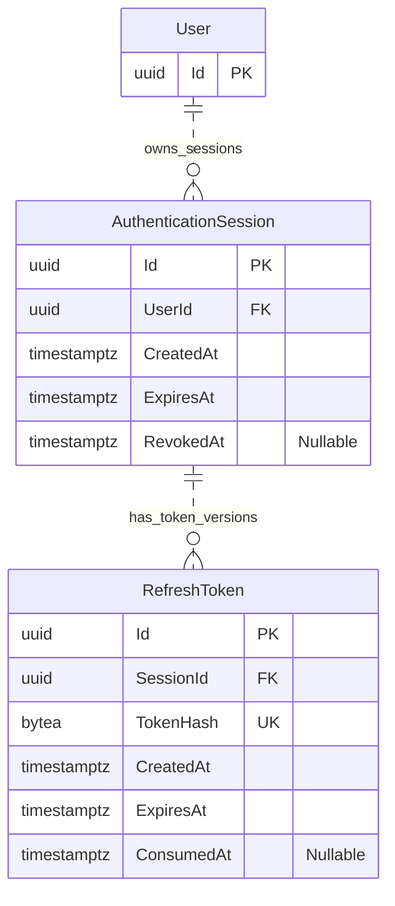

# Hospital Platform — Authentication Persistence Model

## 1. Purpose

This document defines technical authentication persistence for [ADR-0012](adr/0012-authentication-sessions.md), separately from the scheduling [ERD](ERD.md).

The session policy is accepted. This document is a database design, not implemented authentication or validated migrations.

## 2. Diagram

User is the existing account, shown only with its key. Sessions and refresh-token records are owned by Authentication; they do not introduce another profile type.

## 3. Constraints and Indexes

| Record | Constraint or index |
| --- | --- |
| AuthenticationSession | Required UserId foreign key to User.Id |
| AuthenticationSession | ExpiresAt greater than CreatedAt and no later than 7 days after CreatedAt |
| AuthenticationSession | Nullable RevokedAt; populated when revoked |
| AuthenticationSession | Index on UserId for account session revocation |
| RefreshToken | Required SessionId foreign key to AuthenticationSession.Id |
| RefreshToken | Required unique TokenHash containing a 32-byte SHA-256 digest |
| RefreshToken | ExpiresAt greater than CreatedAt |
| RefreshToken | Nullable ConsumedAt; populated when successfully rotated |
| RefreshToken | Partial unique index on SessionId WHERE ConsumedAt IS NULL |

The partial unique index permits multiple consumed versions but at most one unconsumed token row per session. It does not indicate whether that row is expired or its session is revoked; both conditions must be checked.

The refresh workflow requires token expiry not to exceed session expiry. Validate this cross-table condition in the coordinated session transaction. Do not implement a CHECK constraint that reads another table.

Create the session and initial token together. Do not overwrite a consumed token row with its replacement; preserve consumed hashes until session expiry to recognize reuse. The replacement uses the same SessionId and the original session deadline.

Foreign keys restrict deletion while dependent records exist. Cleanup removes expired sessions and token records in dependency order after the retention period. No client-visible session-management or logout-all feature is introduced by these indexes.

## 4. Session Lifecycle

- Login creates an independent session with an absolute 7-day deadline and one refresh-token version.
- Access JWTs have a maximum 15-minute lifetime, capped by the session's expiry, with sub identifying User.Id and sid identifying AuthenticationSession.Id.
- Refresh locks the session row and checks current account eligibility, session state, expiry, and token consumption.
- Successful rotation consumes the old row and inserts the new hashed token in one transaction.
- Reuse of a consumed token revokes its session. Commit that revocation even though the request returns a rejection.
- Logout revokes only the current session. Account suspension or deactivation revokes all of its sessions atomically with the status change.
- Reactivation requires a new login; revoked sessions are not restored.

Raw refresh tokens are generated from 32 cryptographically random bytes and returned only through the selected client credential transport. PostgreSQL stores their hashes. Access JWTs are not persisted as token records.

## 5. Current Authorization

Every protected request validates the JWT and reads the referenced session, its User ownership, expiry/revocation, current AccountStatus, and the profile data needed for permissions.

Permissions use current User.ProfileType and StaffRole. A valid signature does not override suspension, deactivation, ownership, or patient verification rules. Cache data is not authoritative for these checks.

PendingVerification patients may log in, refresh their session, log out, and read only their own account/profile, account and identity-verification status, and verification instructions. Deny all other protected patient operations, including profile updates and appointment management. Public specialty and doctor information remains accessible. Activation does not require a new login: subsequent checks use the current account status, while booking/rescheduling still require verified identity.

Revocation applies to subsequent checks. A write already executing still needs its normal transaction and concurrency validation.

## 6. Implementation Decisions Still Required

- Signing algorithm, trusted keys, key rotation, issuer, audience, and expiration clock-skew policy.
- Web deployment origins, cookie scope/SameSite, CORS, and CSRF defenses for the proposed HttpOnly refresh cookie.
- Mobile secure-storage library and web refresh coordination across tabs.
- EF Core mappings, migration details, error handling, retention/cleanup execution, and concurrency tests.

## 7. References

- [Authentication Session ADR](adr/0012-authentication-sessions.md)
- [Architecture](Architecture.md)
- [PostgreSQL constraints](https://www.postgresql.org/docs/current/ddl-constraints.html)
- [PostgreSQL partial indexes](https://www.postgresql.org/docs/current/indexes-partial.html)
