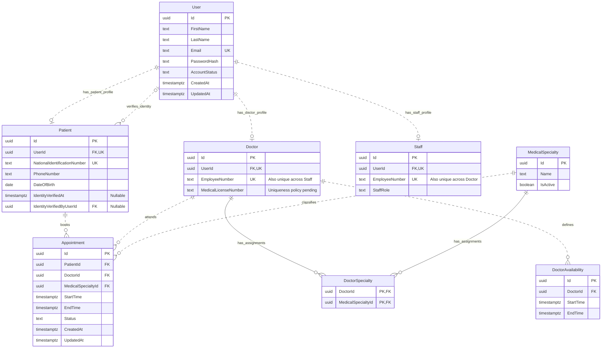

# Hospital Platform — Entity Relationship Diagram

## 1. Purpose

This document translates [DomainModel.md](DomainModel.md) into a relational model for Version 1.

It defines the proposed tables, keys, relationships, and persistence constraints. It is a design document, not an executable database schema.

The diagram preserves separate Id and UserId attributes on Patient, Doctor, and Staff. UUID identifiers are proposed for all entities with independent identifiers. These types are persistence choices rather than new domain rules.

---

## 2. Diagram

The three profile relationships are mutually exclusive: each User must have exactly one Patient, Doctor, or Staff profile in total. Mermaid shows the individual optional relationships but does not express this cross-table rule.

The second User–Patient relationship represents identity verification through IdentityVerifiedByUserId. It is distinct from the patient's account relationship through UserId.

---

## 3. Notation

| Notation | Meaning |
| --- | --- |
| PK | Primary key identifying a row |
| FK | Foreign key referencing another table |
| UK | Unique key within a table |
| `\|\|` | Exactly one |
| `o\|` | Zero or one |
| `o{` | Zero or more |
| `--` | Identifying relationship: the parent key is part of the child primary key |
| `..` | Non-identifying relationship: the child has a separate primary key |

The two PK attributes in DoctorSpecialty form one composite primary key. Neither attribute is unique on its own.

All attributes are required unless marked Nullable. Application workflows remain responsible for determining when and by whom data may be changed.

---

## 4. Tables and Relationships

### 4.1 User and Profiles

User contains authentication data, shared personal information, and AccountStatus.

Patient, Doctor, and Staff each have their own Id and a required, unique UserId referencing User.Id.

This provides:

- exactly one User for each profile;
- at most one Patient row for a given User;
- at most one Doctor row for a given User;
- at most one Staff row for a given User.

These foreign keys and unique constraints do not, by themselves, prevent the same User from appearing in different profile tables or having no profile. The exactly-one-profile rule requires additional enforcement.

Account and profile creation must occur in one transaction. A database enforcement strategy for the cross-table rule remains pending; the diagram must not be interpreted as already guaranteeing it.

### 4.2 Patient Identity Verification

IdentityVerifiedAt and IdentityVerifiedByUserId are nullable together before verification and populated together afterward.

IdentityVerifiedByUserId references User.Id, preserving the identity of the account that performed verification.

A CHECK constraint must require both verification fields to be null or both to be non-null.

The foreign key only guarantees that the User exists. Authorization must additionally check that the actor has a Staff profile with StaffRole.Receptionist and is authorized at the time of verification.

Subsequent account-status or role changes must not erase the verification record. Verification does not automatically reactivate Suspended or Deactivated accounts.

### 4.3 Doctor and Staff

Doctor stores EmployeeNumber and MedicalLicenseNumber. Staff stores EmployeeNumber and StaffRole.

StaffRole accepts Receptionist or Administrator. No separate Receptionist, Administrator, or Employee table is introduced in Version 1.

EmployeeNumber has a unique constraint in each table. Global uniqueness across both tables is an additional requirement that these independent constraints do not enforce.

The cross-table enforcement mechanism remains pending. An application-only check followed by an insert is insufficient under concurrent requests.

### 4.4 Doctor and MedicalSpecialty

DoctorSpecialty is the join table implementing the many-to-many relationship.

Its composite primary key is (DoctorId, MedicalSpecialtyId), preventing duplicate assignments.

It has no independent Id and is not a separate domain entity in Version 1.

Appointment references Doctor and MedicalSpecialty directly, not DoctorSpecialty. Booking and rescheduling must validate the assignment against authoritative data.

No composite foreign key from Appointment to DoctorSpecialty is proposed: removing an assignment must not implicitly delete historical appointments. The policy for removing assignments that affect existing Scheduled appointments remains pending.

### 4.5 DoctorAvailability

DoctorAvailability stores concrete availability periods belonging to a Doctor. Recurring schedule templates are not introduced by this model.

StartTime and EndTime describe the full period. Available slots are calculated dynamically using the applicable duration and existing Scheduled appointments.

There is no AppointmentSlot table or required Appointment-to-DoctorAvailability foreign key. The application must validate that a booking or rescheduling interval fits entirely within a valid availability period.

Availability changes must preserve existing Scheduled appointments, including when a change races with a booking request.

### 4.6 Appointment

Appointment references exactly one Patient, Doctor, and MedicalSpecialty.

It stores the actual interval and one of the Scheduled, Cancelled, or Completed states.

Cancellation updates the state and preserves the row. Cancelled and Completed are terminal states.

Rescheduling must preserve the original appointment if the replacement interval cannot be reserved. Updating the existing row inside a transaction is a simple candidate for Version 1; its history policy remains pending.

---

## 5. Persistence Constraints

| Table | Required constraint |
| --- | --- |
| User | Unique Email using a consistently defined email normalization policy |
| User | AccountStatus restricted to PendingVerification, Active, Suspended, or Deactivated |
| Patient, Doctor, Staff | Required unique UserId referencing User.Id |
| Patient | Unique NationalIdentificationNumber |
| Patient | Verification fields both absent or both populated |
| Patient | Nullable IdentityVerifiedByUserId referencing User.Id |
| Doctor, Staff | Unique EmployeeNumber within each table, plus separate cross-table enforcement |
| Staff | StaffRole restricted to Receptionist or Administrator |
| DoctorSpecialty | Composite primary key (DoctorId, MedicalSpecialtyId) and both foreign keys |
| DoctorAvailability | DoctorId foreign key and EndTime greater than StartTime |
| Appointment | PatientId, DoctorId, and MedicalSpecialtyId foreign keys |
| Appointment | EndTime greater than StartTime |
| Appointment | Status restricted to Scheduled, Cancelled, or Completed; initial status Scheduled |

Foreign keys should restrict deletion of referenced rows rather than cascade-delete appointment history or verification actors. Account deactivation is a status change, not deletion.

Valid enum values alone do not enforce state transitions. Authorization, permitted transitions, future timing, patient verification, doctor-specialty membership, and availability containment require additional transactional validation.

---

## 6. Scheduling Concurrency

The proposed PostgreSQL approach is an exclusion constraint combining DoctorId equality and overlapping timestamp ranges.

For Appointment, the constraint applies only to rows with Status = Scheduled. For DoctorAvailability, it applies to all availability periods.

Use half-open intervals [StartTime, EndTime), allowing adjacent intervals such as 09:00–09:30 and 09:30–10:00 without treating them as overlapping.

The proposed implementation uses PostgreSQL tstzrange with a GiST exclusion constraint and the btree_gist extension for UUID equality. This must be confirmed during migration design and tested with simultaneous requests against different API instances.

The appointment exclusion constraint protects booking and rescheduling writes. A failed rescheduling transaction must leave the original row unchanged.

Exclusion constraints alone do not protect availability containment, profile exclusivity, patient eligibility, or doctor-specialty membership. Their validation and the corresponding mutations need a coordinated transaction and locking strategy, still to be defined.

Redis is not the authority for these validations.

---

## 7. Proposed Data Types

| Data | Proposed PostgreSQL type |
| --- | --- |
| Independent identifiers and foreign keys | uuid |
| Names, email, password hash, identification and employee numbers | text |
| DateOfBirth | date |
| Appointment, availability, verification, and audit timestamps | timestamptz |
| AccountStatus, StaffRole, Appointment.Status | text with CHECK constraints |
| MedicalSpecialty.IsActive | boolean |

Identification, employee, and license numbers are text because they are identifiers rather than quantities and may contain leading zeros or letters.

timestamptz represents an instant; it does not preserve an original named time zone. Clients must submit unambiguous instants. The hospital's display time zone and scheduling duration policy remain to be selected.

PostgreSQL storage names and Entity Framework Core mappings will be defined during implementation; the diagram uses domain names for readability.

---

## 8. Decisions Still Required

- Database enforcement of exactly one profile per User.
- Global EmployeeNumber uniqueness across Doctor and Staff.
- MedicalLicenseNumber uniqueness policy.
- Email and national-identification normalization policies.
- Complete administrative AccountStatus transition policy.
- Exact permissions available to PendingVerification accounts.
- Appointment duration and hospital display time zone.
- Effect of specialty deactivation, assignment removal, and doctor suspension on existing appointments.
- Rescheduling persistence and history policy.
- Transaction and locking strategy for validation across tables.
- Migration details and concurrency tests for the proposed exclusion constraints.

The diagram is complete for the current domain entities. These open decisions must be resolved before treating it as a production-ready schema.

Authentication infrastructure, including refresh-token persistence, is outside this scheduling ERD and will be designed separately.

---

## 9. References

- [Domain Model](DomainModel.md)
- [Mermaid entity relationship diagram syntax](https://mermaid.js.org/syntax/entityRelationshipDiagram.html)
- [PostgreSQL constraints](https://www.postgresql.org/docs/current/ddl-constraints.html)
- [PostgreSQL range types and exclusion constraints](https://www.postgresql.org/docs/current/rangetypes.html)
- [PostgreSQL btree_gist extension](https://www.postgresql.org/docs/current/btree-gist.html)
