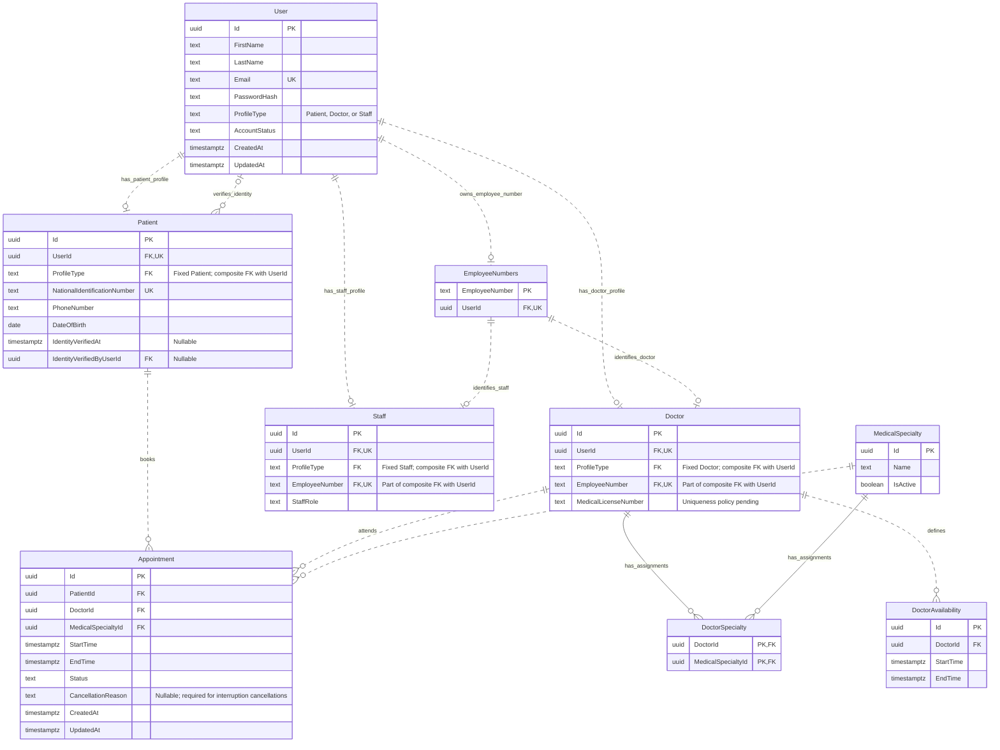

# Hospital Platform — Entity Relationship Diagram

## 1. Purpose

This document translates [DomainModel.md](DomainModel.md) into a relational model for Version 1.

It defines the proposed tables, keys, relationships, and persistence constraints. It is a design document, not an executable database schema.

The diagram preserves separate Id and UserId attributes on Patient, Doctor, and Staff. UUID identifiers are proposed for all entities with independent identifiers. These types are persistence choices rather than new domain rules.

---

## 2. Diagram

The three profile relationships are mutually exclusive: each User must have exactly one Patient, Doctor, or Staff profile in total. Mermaid shows the individual optional relationships but does not express this cross-table rule.

The second User–Patient relationship represents identity verification through IdentityVerifiedByUserId. It is distinct from the patient's account relationship through UserId.

EmployeeNumbers is a technical registry, not an additional User profile or Employee domain entity. Each employee profile references the registry through the composite pair (EmployeeNumber, UserId).

---

## 3. Notation

| Notation | Meaning |
| --- | --- |
| PK | Primary key identifying a row |
| FK | Foreign key referencing another table |
| UK | Unique key within a table |
| `\|\|` | Exactly one |
| `o\|` | Zero or one |
| `o{` | Zero or more |
| `--` | Identifying relationship: the parent key is part of the child primary key |
| `..` | Non-identifying relationship: the child has a separate primary key |

The two PK attributes in DoctorSpecialty form one composite primary key. Neither attribute is unique on its own.

All attributes are required unless marked Nullable. Application workflows remain responsible for determining when and by whom data may be changed.

---

## 4. Tables and Relationships

### 4.1 User and Profiles

User contains authentication data, shared personal information, and AccountStatus.

Patient, Doctor, and Staff each have their own Id and a required, unique UserId referencing User.Id.

This provides:

- exactly one User for each profile;
- at most one Patient row for a given User;
- at most one Doctor row for a given User;
- at most one Staff row for a given User.

User has a required ProfileType restricted to Patient, Doctor, or Staff, with UNIQUE (Id, ProfileType) as a composite foreign-key target.

Each profile table has a required ProfileType constrained to its fixed value by a CHECK constraint. Its composite (UserId, ProfileType) foreign key must match the account. Combined with unique UserId, this prevents multiple profile types or duplicate profiles for the same User.

These constraints enforce at most one profile, not its existence. Initially deferred constraint triggers on User and the profile tables must check that each affected, still-existing User has exactly one matching profile before the transaction commits. Changes to account linkage must check both old and new owners.

Account and profile creation occur in one transaction, allowing the temporary account-without-profile state before commit. Removing the only profile while preserving its User must fail. Deactivation preserves the profile.

ProfileType distinguishes profile types; StaffRole distinguishes staff permissions. Fixed ProfileType columns on profile tables are persistence discriminators, not independently editable domain data.

See [ADR-0008](adr/0008-single-user-profile.md). This is the selected enforcement design; trigger implementation, locking, and concurrent-write behavior must still be validated.

### 4.2 Patient Identity Verification

IdentityVerifiedAt and IdentityVerifiedByUserId are nullable together before verification and populated together afterward.

IdentityVerifiedByUserId references User.Id, preserving the identity of the account that performed verification.

A CHECK constraint must require both verification fields to be null or both to be non-null.

The foreign key only guarantees that the User exists. Authorization must additionally check that the actor has a Staff profile with StaffRole.Receptionist and is authorized at the time of verification.

Subsequent account-status or role changes must not erase the verification record. Verification does not automatically reactivate Suspended or Deactivated accounts.

### 4.3 Doctor and Staff

Doctor stores EmployeeNumber and MedicalLicenseNumber. Staff stores EmployeeNumber and StaffRole.

StaffRole accepts Receptionist or Administrator. No separate Receptionist, Administrator, or Employee table is introduced in Version 1.

EmployeeNumbers centrally registers EmployeeNumber as its primary key and UserId as a required unique foreign key to User.Id. This gives each registered number one account owner and each account at most one registered number.

Declare an additional UNIQUE (EmployeeNumber, UserId) key on EmployeeNumbers as the target of composite foreign keys from Doctor and Staff. Each profile must reference the registry using both columns, preventing it from using a number registered to another User.

EmployeeNumber remains required and unique in each employee profile. The registry primary key enforces global number ownership, including concurrent registration attempts. Combined with the separate exactly-one-profile rule, a number identifies exactly one Doctor or Staff profile.

Account, number registration, and employee profile creation must be committed together. Deactivation preserves the number registration. Number normalization and generation policies remain pending.

The registry does not, by itself, prevent a User from having both profile types or ensure every registry row has an employee profile. Profile exclusivity and existence are handled by ADR-0008; registration workflows must additionally avoid creating employee-number records for Patient accounts.

See [ADR-0007](adr/0007-employee-number-registry.md) for the decision and alternatives.

### 4.4 Doctor and MedicalSpecialty

DoctorSpecialty is the join table implementing the many-to-many relationship.

Its composite primary key is (DoctorId, MedicalSpecialtyId), preventing duplicate assignments.

It has no independent Id and is not a separate domain entity in Version 1.

Appointment references Doctor and MedicalSpecialty directly, not DoctorSpecialty. Booking and rescheduling must validate the assignment against authoritative data.

No composite foreign key from Appointment to DoctorSpecialty is proposed: removing an assignment must not implicitly delete historical appointments. Reject removal while the DoctorId and MedicalSpecialtyId pair has future Scheduled appointments. Reception must cancel affected appointments first with a patient-visible reason and the existing in-app guidance. Cancelled, Completed, and past appointments do not block removal and remain unchanged. Check for blocking appointments and delete the association in one transaction under the ADR-0005 lock protocol.

### 4.5 DoctorAvailability

DoctorAvailability stores concrete availability periods belonging to a Doctor. Recurring schedule templates are not introduced by this model.

No holiday table or calendar is introduced in Version 1. Non-working dates are represented by absent doctor availability; a weekday holiday with valid availability is not automatically excluded. Existing Scheduled appointments must be handled through valid cancellation workflows before a later absence permits removal of their covering availability.

StartTime and EndTime describe the full period. Available slots are calculated dynamically using the applicable duration and existing Scheduled appointments.

There is no AppointmentSlot table or required Appointment-to-DoctorAvailability foreign key. The application must validate that a booking or rescheduling interval fits entirely within a valid availability period.

Availability changes must preserve existing Scheduled appointments, including when a change races with a booking request.

### 4.6 Appointment

Appointment references exactly one Patient, Doctor, and MedicalSpecialty.

It stores the actual interval and one of the Scheduled, Cancelled, or Completed states.

Cancellation updates the state and preserves the row. Cancelled and Completed are terminal states.

CancellationReason stores the patient-visible reason and is required for receptionist cancellations caused by doctor suspension/deactivation or specialty deactivation. No separate notification table is introduced: clients display the persisted cancellation information in appointment lists and details, including future cancelled appointments.

An inactive specialty or non-Active doctor account blocks new booking and rescheduling for that selection. Existing appointments and availability are preserved until normal workflows change them; reception decides which future appointments to cancel. See [ADR-0011](adr/0011-service-interruption-cancellations.md).

Rescheduling updates StartTime, EndTime, and UpdatedAt on the existing row inside one transaction. Id, PatientId, DoctorId, MedicalSpecialtyId, CreatedAt, and Scheduled status remain unchanged. If validation or persistence fails, roll back and preserve the original row unchanged.

Exclude this row from its own application-level conflict check. The appointment exclusion constraint applies to interval updates as well as inserts. [ADR-0005](adr/0005-scheduling-concurrency.md) coordinates updates through Doctor/Appointment row locks and an expected UpdatedAt check; successful mutations persist a strictly newer timestamp at database precision.

Version 1 does not introduce replacement appointment rows or a rescheduling-history table. See [ADR-0010](adr/0010-rescheduled-existing-appointment.md).

---

## 5. Persistence Constraints

| Table | Required constraint |
| --- | --- |
| User | Unique Email using a consistently defined email normalization policy |
| User | AccountStatus restricted to PendingVerification, Active, Suspended, or Deactivated |
| User | Required ProfileType restricted to Patient, Doctor, or Staff; UNIQUE (Id, ProfileType) |
| Patient, Doctor, Staff | Required unique UserId and required ProfileType fixed to the table's type |
| Patient, Doctor, Staff | Immediate composite (UserId, ProfileType) foreign key to User |
| User, Patient, Doctor, Staff | Initially deferred constraint triggers requiring exactly one matching profile for each affected, still-existing User |
| Patient | Unique NationalIdentificationNumber |
| Patient | Verification fields both absent or both populated |
| Patient | Nullable IdentityVerifiedByUserId referencing User.Id |
| EmployeeNumbers | EmployeeNumber primary key; required unique UserId referencing User.Id |
| EmployeeNumbers | UNIQUE (EmployeeNumber, UserId) as the composite foreign-key target |
| Doctor, Staff | Required unique EmployeeNumber and composite (EmployeeNumber, UserId) foreign key to EmployeeNumbers |
| Staff | StaffRole restricted to Receptionist or Administrator |
| DoctorSpecialty | Composite primary key (DoctorId, MedicalSpecialtyId) and both foreign keys |
| DoctorAvailability | DoctorId foreign key and EndTime greater than StartTime |
| Appointment | PatientId, DoctorId, and MedicalSpecialtyId foreign keys |
| Appointment | EndTime greater than StartTime |
| Appointment | EndTime minus StartTime equals exactly 30 minutes |
| Appointment | Status restricted to Scheduled, Cancelled, or Completed; initial status Scheduled |
| Appointment | Nullable CancellationReason; the interruption-cancellation use case requires a patient-visible reason |

Foreign keys should restrict deletion of referenced rows rather than cascade-delete appointment history or verification actors. Account deactivation is a status change, not deletion.

Valid enum values alone do not enforce state transitions. Authorization, permitted transitions, future timing, patient verification, doctor-specialty membership, and availability containment require additional transactional validation.

---

## 6. Scheduling Concurrency

The selected PostgreSQL approach is an exclusion constraint combining DoctorId equality and overlapping timestamp ranges.

For Appointment, the constraint applies only to rows with Status = Scheduled. For DoctorAvailability, it applies to all availability periods.

Use half-open intervals [StartTime, EndTime), allowing adjacent intervals such as 09:00–09:30 and 09:30–10:00 without treating them as overlapping.

The implementation uses PostgreSQL tstzrange with a GiST exclusion constraint and the btree_gist extension for UUID equality. Migrations must verify extension availability and be tested with simultaneous requests against different API instances.

The appointment exclusion constraint protects booking and rescheduling writes. A failed rescheduling transaction must leave the original row unchanged.

Exclusion constraints alone do not protect availability containment, patient eligibility, or doctor-specialty membership. [ADR-0005](adr/0005-scheduling-concurrency.md) selects READ COMMITTED transactions with locks ordered by User, MedicalSpecialty, Doctor, then Appointment, sorting Ids within each table. Shared parent-row locks protect eligibility reads; exclusive parent-row locks protect eligibility changes. All appointment, availability, and doctor-assignment mutations exclusively lock the affected Doctor row and validate freshly loaded data before writing. Availability edits that invalidate existing Scheduled appointments are rejected.

Profile exclusivity and existence use the separate ADR-0008 design, whose trigger visibility and mutation coordination also require implementation validation.

Redis is not the authority for these validations.

---

## 7. Proposed Data Types

| Data | Proposed PostgreSQL type |
| --- | --- |
| Independent identifiers and foreign keys | uuid |
| Names, email, password hash, identification and employee numbers | text |
| DateOfBirth | date |
| Appointment, availability, verification, and audit timestamps | timestamptz |
| ProfileType, AccountStatus, StaffRole, Appointment.Status | text with CHECK constraints |
| MedicalSpecialty.IsActive | boolean |

Identification, employee, and license numbers are text because they are identifiers rather than quantities and may contain leading zeros or letters.

timestamptz represents an instant; it does not preserve an original named time zone. API timestamps use ISO 8601 with UTC or an explicit offset. Hospital-local dates and hours are interpreted in America/Montevideo independently of server or database session defaults.

Appointments last exactly 30 minutes and follow a half-hour grid from 09:00 through 17:30, ending by 18:00, Monday through Friday. Availability must fit within that local operating window on a single date. Evaluate weekdays in America/Montevideo; Saturday and Sunday are not bookable. Backend validation applies these rules when creating availability, booking, or rescheduling; database interval constraints do not replace local-hour or weekday validation. See [ADR-0009](adr/0009-appointment-time-policy.md).

PostgreSQL storage names and Entity Framework Core mappings will be defined during implementation; the diagram uses domain names for readability.

---

## 8. Decisions Still Required

- Migration details, deferred-trigger behavior, and concurrency validation for the selected exactly-one-profile design.
- EmployeeNumber normalization and generation policies.
- MedicalLicenseNumber uniqueness policy.
- Email and national-identification normalization policies.
- Complete administrative AccountStatus transition policy.
- Implementation and tests of ADR-0005 locks, stale-appointment checks, timestamp precision, and cross-table validation.
- Migration details and concurrency tests for the selected exclusion constraints.

The diagram is complete for the current domain entities. These open decisions must be resolved before treating it as a production-ready schema.

AuthenticationSession and RefreshToken persistence is defined separately in [AuthenticationModel.md](AuthenticationModel.md) and [ADR-0012](adr/0012-authentication-sessions.md), outside this scheduling ERD.

---

## 9. References

- [Domain Model](DomainModel.md)
- [Mermaid entity relationship diagram syntax](https://mermaid.js.org/syntax/entityRelationshipDiagram.html)
- [PostgreSQL constraints](https://www.postgresql.org/docs/current/ddl-constraints.html)
- [PostgreSQL range types and exclusion constraints](https://www.postgresql.org/docs/current/rangetypes.html)
- [PostgreSQL btree_gist extension](https://www.postgresql.org/docs/current/btree-gist.html)
